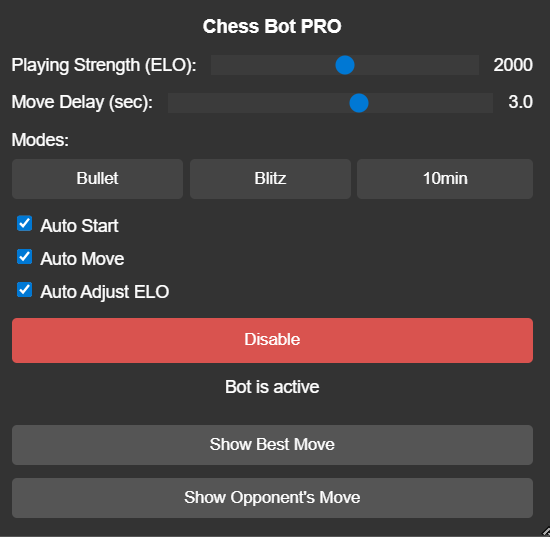

# ShadowMate

This is a full-featured chess bot for Chess.com that uses the **Stockfish** engine to find the best moves. The script works as a browser extension, allowing you to automate games or analyze positions in real time.

**⚠️ Important Note:** Using bots on Chess.com is against their terms of service and can lead to your account being banned. This script is provided for educational and experimental purposes only. You use it at your own risk.

## Key Features

* **Dynamic Advantage Bar:** A visual indicator positioned next to the chessboard that dynamically shows the current advantage in the game based on centipawn analysis from the Stockfish engine. It updates after every move.
* **Customizable ELO:** Set the bot's strength from 1000 to 3000 ELO to play against opponents of various skill levels.
* **Adjustable Delay:** Set a random delay between moves to mimic human behavior and avoid detection.
* **Automatic Modes:**
    * **Auto-Start:** The bot activates automatically as soon as you start a new game.
    * **Auto-Move:** The bot makes moves on its own without your intervention.
    * **Auto-Adjust ELO:** Automatically matches the bot's strength to your opponent's ELO.
* **Manual Mode:** Click the "Show Best Move" button to get a hint and learn how to play better.
* **Opponent Analysis:** Click the "Show Opponent's Move" button to see the best response to your opponent's move.
* **Intuitive Interface:** A simple and clear interface makes it easy to control all settings.
* **Reliability:** Uses multiple methods for move execution, which increases its stability.

## How to Install and Use

1.  Install a user script extension in your browser (Chrome, Firefox, Opera, Edge). **Tampermonkey** is recommended ([Chrome](https://chrome.com/webstore/detail/tampermonkey/dhdgffkkebhmkfjojejmpbldmpobfkfo?hl=en), [Firefox](https://addons.mozilla.org/en-US/firefox/addon/tampermonkey/)).
2.  Create a new script in Tampermonkey.
3.  Copy the content of the `chess_bot.js` file and paste it into the editor window.
4.  Save the script. It will be activated automatically when you visit Chess.com.
5.  After starting a game on the website, you will see the bot's interface in the top right corner, and the dynamic advantage bar will appear to the left of the chessboard.

## Demo

## Technical Details

The script is developed in pure JavaScript using the jQuery library. For chess calculations, it uses the web version of **Stockfish 9**, which runs as a Web Worker.

## Disclaimer

The author is not responsible for any consequences related to the use of this script, including, but not limited to, account bans. Be responsible and use this tool ethically.
